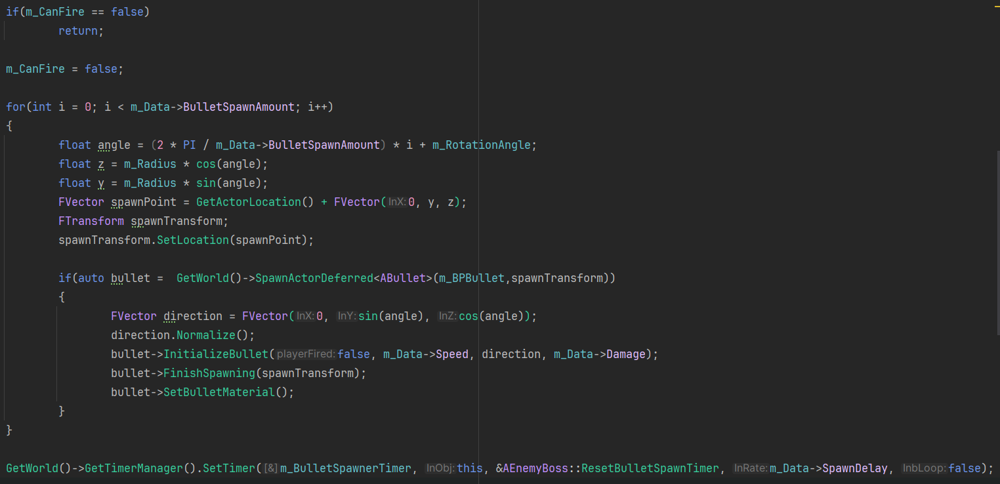
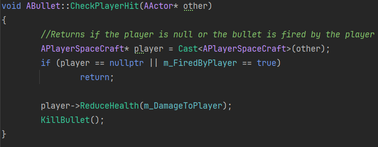
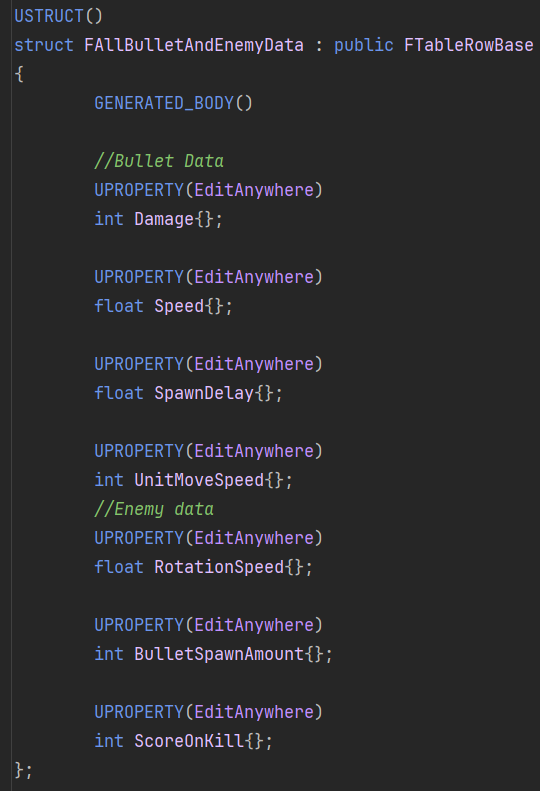

# SpaceWar
Space War is a small bullet hell game.
# What do i want to accomplish with this project
In this small side project i want to learn to work with unreal c++. So i am making a little space game where you shoot enemies and get points. The game keeps going until you die or at the moment when you just kill a enemy.

# Result
![Result][def]
## The Enemy 
### Behavior:
The enemy his behavior is simple just a seek behavior that goes towards the player.
### Bullet Spawn Patterns:
What makes the enemy unique are his bullet spawn patterns.
 
These are the parametersthat influence the pattern:
* Rotation Speed
* Amount of bullets Spawned
* Bullet Speed
* Direction of the bullet
* Spawn delay
 

The bullet spawn function of the enemy:

## The Player
The player uses the enhacned input system of unreal. The movement is with WASD and space bar to shoot a bullet in front of him.

## The bullets
After a bullet is spawned an initialized by a player or enemy a timer starts. After the Delay the bullet gets destroyed. We assign a different material to the bullet depending if it is shot by the player or enemy. 
The bullets and their collision are simple they check for these collisions:
* With the Player
* With Another Bullet
* With the enemy 
 

Player collision Function: 

## Data
All the aprameter to make a unique pattern are in the data table. damage, score and unitmovementspeed are also in the data table for if i need to change values all the values are in one place.
 

[def]: Images/SpaceWarResultGif.gif